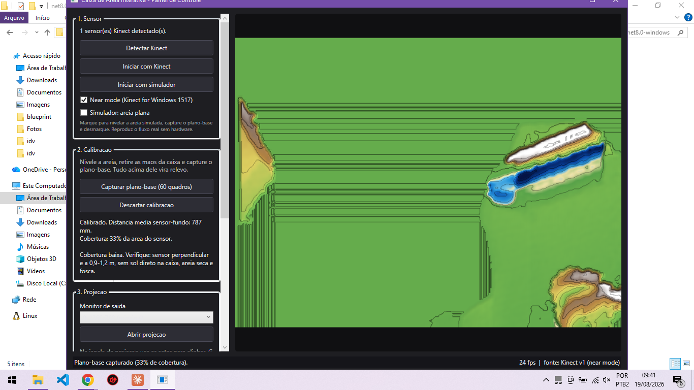
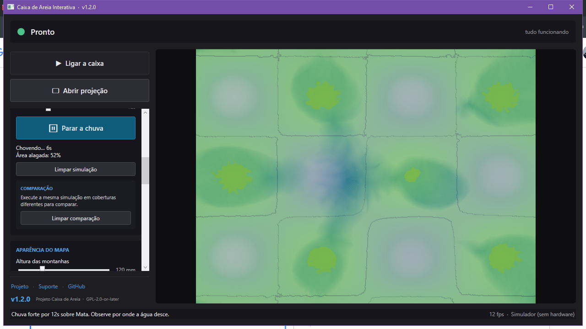
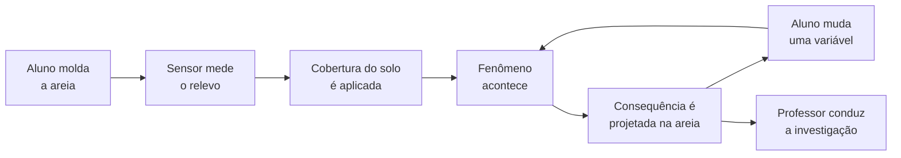
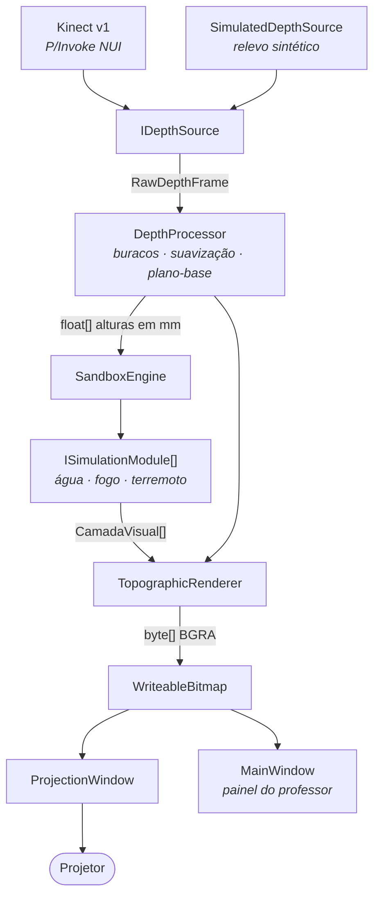

# Caixa de Areia Interativa

**Uma plataforma de ensino onde os estudantes constroem o território com as mãos e o
software mostra o que acontece com ele.**

O aluno molda a areia. Um Kinect mede o relevo trinta vezes por segundo. Um projetor
devolve sobre a mesma areia um mapa topográfico colorido — e, sobre esse mapa, fenômenos
ambientais que reagem ao terreno que ele acabou de construir. Chove, e a água escorre pelo
vale que ele cavou. Ele muda a cobertura do solo, chove de novo, e compara.

A pergunta da aula deixa de ser *"o que é uma bacia hidrográfica?"* e passa a ser
*"o que acontece com o vale que vocês construíram, se chover assim?"*.

**Projeto Caixa de Areia** — Brasília, DF · 2026 · Licenciado sob
[GPL-2.0-or-later](LICENSE)

**Versão estável: [v1.4.0](https://github.com/luisfilipegdc/caixadeareia/releases/latest)** · [Página do projeto](https://luisfilipegdc.com.br/caixa-de-areia) ·
[Suporte](mailto:contato@luisfilipegdc.com.br) ·
[Repositório](https://github.com/luisfilipegdc/caixadeareia)

<p align="center">
  
  
</p>

---

## O ciclo da experiência



O relevo vem das mãos dos estudantes. O software define **o que cobre** esse relevo —
mata, pastagem, cidade — e **que evento** acontece sobre ele. Essa separação é o que
permite a pergunta mais útil da aula: *mesmo terreno, cobertura diferente, o que muda?*

---

## Estado do projeto

Esta seção existe para não confundir o que já funciona com o que está planejado.
Nada abaixo da linha "roadmap" existe no código.

### ✅ Funciona hoje

| Recurso | Observação |
|---|---|
| Captura com Kinect v1 | 20–29 fps a 640×480, near mode ativo |
| Calibração de plano-base | Por pixel, salva em disco, recarregada sozinha ao abrir |
| Mapa topográfico projetado | Rampa hipsométrica, curvas de nível, sombreamento |
| Alinhamento da projeção | Escala, deslocamento, rotação e espelhamento, salvos |
| Reconexão automática do sensor | Religa sozinho quando o cabo é esbarrado |
| **Chuva e enchente** | Escoamento por tubos virtuais, infiltração, saturação do solo |
| **12 coberturas de solo** | Mata, várzea, pastagem, agricultura, cidade drenada, asfalto… |
| **Queimada** | Propagação por vento, encosta e combustível; água barra o fogo |
| **Terremoto** | Ondas, amplificação por tipo de solo, risco de deslizamento |
| **Comparação entre execuções** | Avisa quando o relevo mudou e a comparação deixa de isolar a variável |
| Simulador sem hardware | Relevo sintético para preparar aula e desenvolver sem Kinect |

### 🧪 Implementado, com ressalva

| Recurso | Ressalva |
|---|---|
| Volumes em litros | **Estimativa.** Dependem da largura que o sensor cobre, ainda não medida em campo. A interface marca com "≈". O [procedimento de medição](docs/CALIBRACAO-FISICA.md) está escrito. Porcentagens não têm esse problema |
| Alinhamento projetor↔caixa | Apenas afim. Projetor muito oblíquo deixa distorção de perspectiva que só uma homografia corrige |
| Erosão | Calculada a cada quadro, ainda **não exibida** na projeção |
| Cenários pedagógicos prontos | Seis cenários existem no código (Enchente no RS, várzea preservada, cidade drenada…) e ainda **não têm caminho de interface** |
| Região de interesse (ROI) | Existe na configuração, sem controle na tela — o mapa cobre todo o campo de visão do sensor |
| Contexto de dados públicos | **Experimental.** Focos de calor do INPE, preparados fora da aula e lidos de arquivo local. É contexto: não alimenta nenhum parâmetro de simulação. Ver [Dados públicos](docs/DADOS-PUBLICOS.md) |

### 🗺️ Roadmap — **não implementado**

Temas ambientais, biomas (Cerrado, Mata Atlântica, Caatinga), lençol freático, degelo de
calotas, camada pedagógica declarativa e instalador. O plano completo, com o estado real
de cada fase, está no **[Roadmap](ROADMAP.md)**.

---

## Honestidade científica

O projeto se compromete a distinguir quatro coisas na tela:

| Categoria | Exemplo neste sistema |
|---|---|
| **Medição real** | A distância que o Kinect lê; o plano-base capturado na calibração |
| **Derivação matemática** | Altura = plano-base − distância; curvas de nível; assinatura do relevo |
| **Modelo didático** | Infiltração por tipo de solo, propagação do fogo, ondas sísmicas |
| **Efeito visual** | A rampa de cores, o sombreamento, o clarão da onda |

Consequências práticas, já aplicadas no código:

- **Os parâmetros de solo são qualitativos na interface.** O sistema diz *"absorve muita
  água"*, não *"absorve 3,2 mm/s"*. Os números existem no modelo, mas exibi-los com uma
  casa decimal comunicaria uma precisão hidrológica que eles não têm.
- **Valores absolutos não calibrados vêm marcados.** Litros aparecem com "≈" enquanto a
  geometria da caixa não for medida.
- **Comparações avisam quando não são válidas.** Se o relevo mudou entre duas execuções, o
  sistema diz que parte da diferença pode vir da areia, não da cobertura.

Os coeficientes dos modelos são **valores didáticos**, escolhidos para que a diferença
entre uma bacia preservada e uma impermeabilizada apareça numa aula de meia hora. A ordem
de grandeza segue a literatura; o objetivo é o estudante enxergar a relação, não prever
uma cheia real.

---

## Hardware

| Item | Requisito |
|---|---|
| Sensor | **Kinect for Windows modelo 1517** (`VID_045E`, `PID_02BE/02BF`) |
| Projetor | Qualquer um, o mais próximo possível do eixo vertical da caixa |
| Computador | Windows 10/11 64 bits |
| Caixa | ~100×125 cm, com 8–15 cm de areia clara e fosca |

O modelo 1517 importa: é o único que suporta **near mode** (0,4–3,0 m em vez de
0,8–4,0 m). Com o sensor a cerca de 1 m da areia, é a diferença entre leitura limpa e
bordas cortadas.

### Montagem

```
            [ Projetor ]        [ Kinect ]
                  \                 |
                   \                |   ~1,3 m
                    \               |
        ┌────────────────────────────────────┐
        │            areia                   │
        └────────────────────────────────────┘
```

O cálculo da altura, da cobertura do campo de visão e da relação de projeção está em
**[Montagem física](docs/MONTAGEM-FISICA.md)** — incluindo o achado de que uma viga longa
demais deixa parte da caixa fora do campo de visão.

---

## Instalação

### Uso em sala — sem compilar nada

**[⬇ Baixar a versão mais recente](https://github.com/luisfilipegdc/caixadeareia/releases/latest)**
— ~68 MB · Windows 10/11 64 bits

O link acima abre sempre a release mais nova; o executável está nos *Assets*, junto do
`SHA256SUMS.txt` para conferir o download. Hoje: `CaixaInterativa-v1.4.0-win-x64.exe`.

Arquivo único, com o .NET embutido. Só o
[Kinect SDK 1.8](https://www.microsoft.com/en-us/download/details.aspx?id=40278) é
necessário à parte, porque traz o driver do sensor.

> Na primeira execução o Windows pode exibir um aviso do SmartScreen, por ser um
> executável sem certificado de assinatura comercial. Clique em *Mais informações* →
> *Executar assim mesmo*.

Todas as versões: [Releases](https://github.com/luisfilipegdc/caixadeareia/releases).

### Driver do sensor

Se o Kinect já foi usado com libfreenect ou OpenNI, a câmera pode estar presa ao driver
`libusb-win32`, e `NuiGetSensorCount` devolve zero. No Gerenciador de Dispositivos,
desinstale *Microsoft Kinect Camera* marcando *Excluir o software de driver*, e reconecte
o sensor — o driver da Microsoft assume.

O Kinect v1 consome quase toda a banda de um controlador USB 2.0. Se aparecer *"Banda USB
insuficiente"*, use uma porta ligada a outro controlador. **A fonte de energia externa é
obrigatória.**

---

## Desenvolvimento

### Compilar e executar

```bash
dotnet build CaixaInterativa.sln -c Release
```

```bash
dotnet run --project src/CaixaInterativa/CaixaInterativa.csproj -c Release
```

Requer o [.NET 8 SDK](https://dotnet.microsoft.com/download/dotnet/8.0). O projeto é
`net8.0-windows`, x64, e **não tem nenhuma dependência NuGet** — todo o acesso ao sensor é
P/Invoke próprio.

### Sem Kinect na mesa

O `SimulatedDepthSource` gera um relevo sintético com a mesma geometria do sensor real
(640×480, ruído de ~2 mm, ~0,5% de pixels inválidos). Dá para desenvolver, alinhar o
projetor e preparar a aula inteira sem hardware.

No app: **Ajustes técnicos → Usar simulador**. Marcando *Simulador: areia plana* dá para
exercitar o fluxo de calibração, que exige uma superfície nivelada.

### Testes

```bash
dotnet test CaixaInterativa.sln -c Release
```

Nenhum teste precisa de Kinect. A suíte cobre, entre outras coisas:

- **Regressão visual byte a byte** do renderizador, em oito combinações de fenômenos
- Conservação de massa e comportamento do solver de água
- Imunidade da assinatura do relevo ao ruído do sensor
- Que os coeficientes dos modelos didáticos não mudaram sem querer

---

## Arquitetura



**A ideia que sustenta a extensibilidade:** cada simulação declara `CamadaVisual` — um
campo escalar com dimensões, ordem de composição, modo de cor e limiar. O renderizador
sabe **como** desenhar cada modo; não sabe **qual** módulo produziu o campo. Acrescentar
um fenômeno não exige tocar no renderizador.

### Estrutura

```
src/CaixaInterativa/
├── Depth/            captura e abstração de hardware
│   ├── IDepthSource.cs           contrato de fonte de profundidade
│   ├── NuiNative.cs              P/Invoke para Kinect10.dll
│   ├── KinectV1Source.cs         captura real
│   └── SimulatedDepthSource.cs   relevo sintético
├── Processing/
│   ├── DepthProcessor.cs         calibração, buracos, suavização
│   └── AssinaturaDoRelevo.cs     "a areia é a mesma de antes?"
├── Simulation/
│   ├── ISimulationModule.cs      contrato de fenômeno
│   ├── SoilMap.cs                12 coberturas e suas propriedades
│   ├── WaterSimulation.cs        tubos virtuais, infiltração, erosão
│   ├── FireSimulation.cs         autômato celular de propagação
│   ├── EarthquakeSimulation.cs   ondas e amplificação por solo
│   └── Cenarios.cs               cenários pedagógicos (sem UI ainda)
├── Rendering/
│   ├── CamadaVisual.cs           contrato de camada
│   └── TopographicRenderer.cs    rampa, curvas, sombreamento, composição
├── Config/                       persistência e calibração em disco
├── Views/                        painel do professor e janela de projeção
└── SandboxEngine.cs              orquestração
tests/CaixaInterativa.Tests/      regressão visual e comportamento
```

---

## Princípios

1. **Não destruir uma base funcional em nome de arquitetura mais bonita.** O interop com o
   Kinect foi depurado com hardware real e três bugs caros; mexer nele exige motivo forte.
2. **Um módulo completo por vez** — simulação, interface e material pedagógico — antes de
   começar o próximo.
3. **Comentar o porquê, com o número medido junto.** O padrão da base é registrar a
   alternativa descartada e o motivo.
4. **Nunca apresentar modelo didático como medição.**
5. **A aula nasce da comparação**, não da animação bonita.

---

## Documentação

| Documento | O que traz |
|---|---|
| 📖 **[Manual do usuário](docs/MANUAL.md)** | Da instalação à primeira aula, sem pressupor conhecimento técnico |
| 🌐 **[Página do projeto](docs/PROJETO.md)** | Visão geral, resultados medidos e arquitetura |
| 🗺️ **[Roadmap](ROADMAP.md)** | As nove etapas, com o estado real de cada uma |
| 📐 **[Montagem física](docs/MONTAGEM-FISICA.md)** | Altura do sensor, campo de visão, relação de projeção |
| 📏 **[Calibração física](docs/CALIBRACAO-FISICA.md)** | Como medir a largura que o sensor cobre e tornar os litros confiáveis |
| 📦 **[Dados públicos](docs/DADOS-PUBLICOS.md)** | Contexto real do INPE, preparado offline: fluxo, decisões estatísticas e limites |
| 📓 **[Diário de bordo](docs/DIARIO-DE-BORDO.md)** | O registro da construção: decisões, bugs e medições |
| 🔍 **[Auditoria técnica](docs/AUDITORIA-TECNICA.md)** | Leitura integral do código: arquitetura real, gargalos, dívida |
| 🛠 **[Guia de desenvolvimento](docs/DESENVOLVIMENTO.md)** | Caminho de um quadro, como acrescentar um fenômeno, regras de performance e de teste |
| 🖼️ **[Catálogo de imagens](docs/img/README.md)** | Capturas de cada etapa, com contexto |

---

## Contribuir

O projeto aceita contribuições. Antes de abrir um PR:

- **Rode os testes.** `dotnet test` precisa passar, incluindo a regressão visual byte a
  byte. Se a imagem mudar, isso é um resultado a explicar, não um baseline a reescrever.
- **Não altere `Depth/` nem `DepthProcessor` sem necessidade demonstrada.** É código
  validado com hardware que nem todo colaborador tem na mesa.
- **Não invente números científicos.** Parâmetro didático novo precisa declarar que é
  didático e por que aquela ordem de grandeza.
- **Comente o porquê.** Um comentário que explica a alternativa descartada vale mais que
  três que descrevem o que a linha faz.
- **Commits pequenos**, com mensagem que diz a intenção.

Para entender o código antes de mexer, os pontos de entrada mais úteis são
`SandboxEngine.cs`, `ISimulationModule.cs` e `TopographicRenderer.cs`.

---

## Versionamento

O projeto segue [SemVer](https://semver.org/lang/pt-BR/), com três regras e nada além
delas:

| Parte | Quando aumenta |
|---|---|
| **PATCH** — `1.4.0 → 1.4.1` | Correção sem capacidade nova |
| **MINOR** — `1.4.0 → 1.5.0` | Capacidade nova, compatível com quem já usa |
| **MAJOR** — `1.4.0 → 2.0.0` | Mudança incompatível ou reestruturação grande |

A `v1.4.0` é MINOR: trouxe capacidades novas — contexto público offline, comparação
temporal, queimada na interface, registro em arquivo — e mudanças arquiteturais que não
quebram nada de fora. Uma caixa que rodava a v1.3 roda a v1.4.0 com a mesma calibração.

**A versão tem uma fonte só:** `<Version>` em
[`src/CaixaInterativa/CaixaInterativa.csproj`](src/CaixaInterativa/CaixaInterativa.csproj).
Título da janela, tela de suporte e propriedades do executável leem dali, via `AppInfo`.
Não há número de versão escrito à mão em lugar nenhum do código.

O histórico de cada versão está no [CHANGELOG](CHANGELOG.md), e o passo a passo para
publicar uma nova está em [docs/RELEASE.md](docs/RELEASE.md).

---

## Material visual que ainda falta

Registrado aqui para quem puder produzir:

- Um GIF curto do ciclo completo: mão modelando a areia e a projeção acompanhando
- Foto da caixa montada com o pórtico, o sensor e o projetor
- Vídeo de uma comparação A/B: mesmo relevo, mata × área urbana, mesma chuva
- Captura da queimada em andamento sobre relevo real

As imagens atuais em `docs/img/` foram feitas com o simulador e com o sensor sobre uma
mesa — não sobre a caixa montada.
