# Catálogo de imagens

Capturas geradas durante a sessão de desenvolvimento, na ordem em que foram produzidas.
Todas são saídas reais do sistema — nenhuma é montagem ou mockup.

Para usar em documentação, apresentação ou artigo, referencie pelo caminho relativo:
`docs/img/<arquivo>`.

---

## 01 — Mapa topográfico gerado pelo simulador

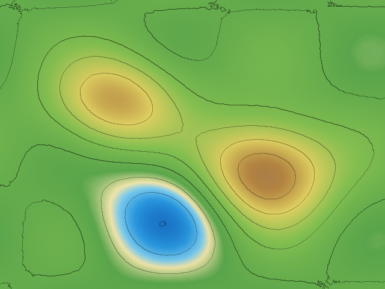

**Legenda:** Primeira validação completa da pipeline de renderização, ainda sem hardware.
Duas colinas (amarelo e marrom), uma bacia inundada com praia de areia na linha d'água
(azul cercado de bege) e curvas de nível fechadas. Gerado a partir de um relevo sintético
que passou por calibração de plano-base, suavização temporal e espacial.

**Medições associadas:** plano-base 830,0 mm · alturas de −44,9 mm a +72,1 mm ·
deriva de 0,13 mm entre quadros consecutivos · 4.075 cores distintas.

**Onde usar:** para mostrar o resultado-alvo da renderização, ou para explicar a rampa
hipsométrica sem depender de hardware.

---

## 02 — O mesmo relevo sem curvas de nível nem sombreamento

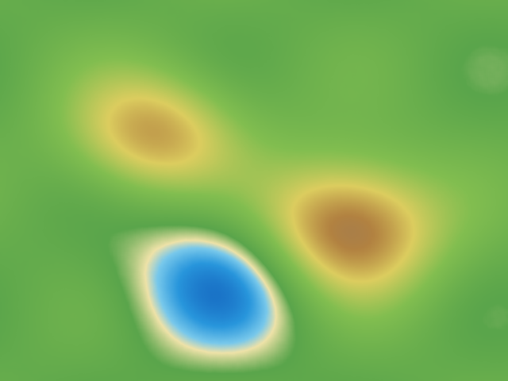

**Legenda:** O mesmo campo de alturas da imagem 01, renderizado apenas com a rampa de
cores. Serve de comparação direta para mostrar quanto as curvas de nível e o sombreamento
de relevo acrescentam à leitura da inclinação.

**Onde usar:** lado a lado com a imagem 01, em material que explique por que curvas de
nível importam pedagogicamente.

---

## 03 — Leitura quase vazia: o near mode que não estava ativo

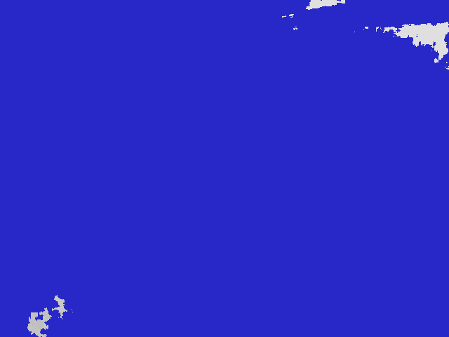

**Legenda:** Kinect apontado para uma mesa a menos de 80 cm. Azul marca pixels sem leitura;
as manchas claras nos cantos são as poucas regiões com retorno. Apenas **1,2%** da imagem
tinha dado válido.

O padrão sugeria superfície brilhante ou sol na cena. A causa real era outra: a flag de
near mode estava errada (`0x00040000`, que é `TOO_FAR_IS_NONZERO`, em vez de `0x00020000`),
então o alcance mínimo permanecia em 800 mm e tudo mais perto lia zero.

**Onde usar:** para ilustrar como um erro de configuração pode imitar perfeitamente um
problema físico de superfície.

---

## 04 — Near mode desligado (controle do teste A/B)

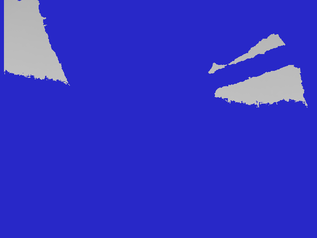

**Legenda:** Mesma cena, com near mode explicitamente desligado. Cobertura de 11%,
distância mínima de 801 mm, metade inferior do quadro completamente morta. Os 801 mm não
são uma medição — são o piso duro do modo padrão do Kinect v1 (0,8 m).

**Medições associadas:** 11,0% de cobertura · mínimo 801 mm.

---

## 05 — Near mode ligado, com a flag correta

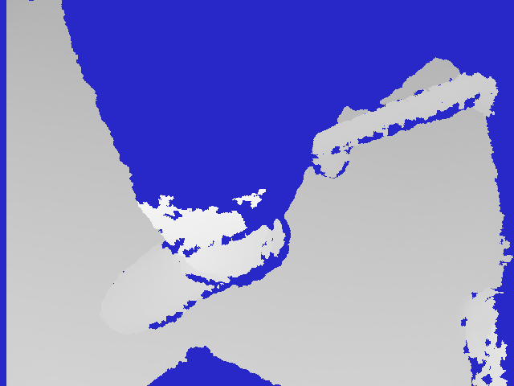

**Legenda:** A mesma cena, sem mover nada, depois de corrigir a flag para `0x00020000`.
A cobertura salta de 6,9% para **66,4%** e a distância mínima cai de 801 mm para
**455 mm**. Objetos sobre a superfície tornam-se legíveis; a metade inferior do quadro,
antes morta, passa a ler entre 76% e 100%.

**Medições associadas:** 66,4% de cobertura · mínimo 455 mm · gradiente coerente de
856 mm no topo a 655 mm na base, o padrão de um sensor inclinado sobre superfície plana.

**Onde usar:** par obrigatório com a imagem 04. É a demonstração mais clara de todo o
projeto de que um valor de constante errado pode custar 90% do dado útil sem gerar
nenhum erro.

---

## 06 — Painel de controle

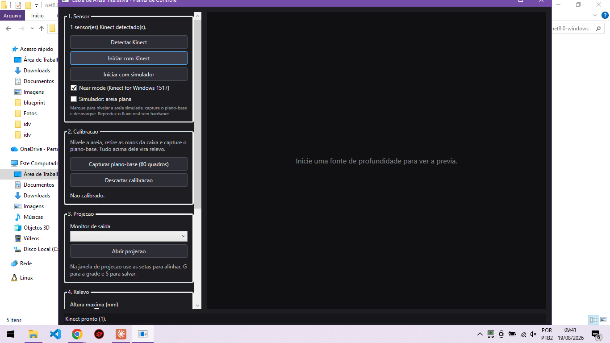

**Legenda:** Interface de operação, organizada na ordem real de uso: sensor, calibração,
projeção, relevo, configuração. Os controles de relevo (altura máxima, profundidade,
intervalo das curvas, suavização) são ajustáveis ao vivo, com a prévia respondendo
imediatamente.

**Onde usar:** documentação de uso, manual do professor.

---

## 07 — Kinect ao vivo, antes de calibrar

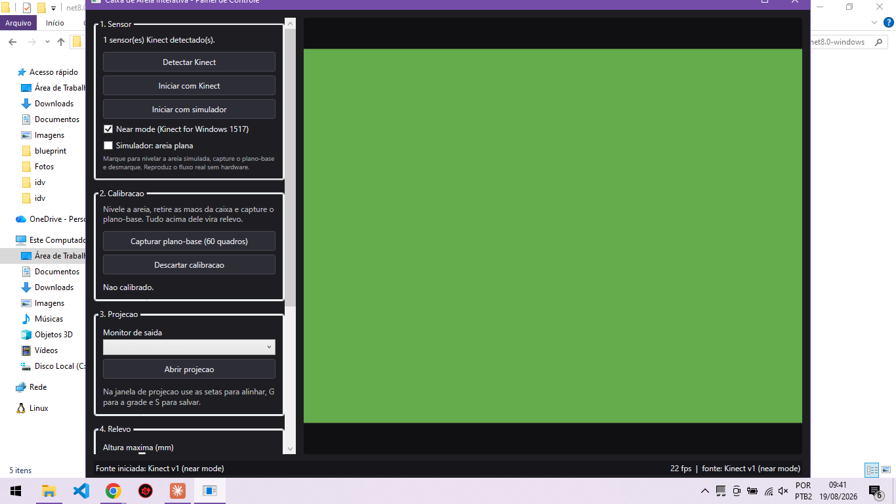

**Legenda:** Sistema capturando do sensor real a 22 fps, mas ainda sem plano-base. O verde
uniforme está correto: sem calibração todas as alturas são zero, e zero cai no verde da
rampa. É o estado esperado antes do passo de calibração, não um defeito.

**Onde usar:** manual de uso, para que o operador não interprete a tela verde como falha.

---

## 08 — Relevo real, calibrado

**Legenda:** O sistema funcionando com o Kinect real depois da calibração de plano-base.
Objetos sobre a mesa aparecem como elevações (marrom, branco) e depressões (azul), com
curvas de nível acompanhando o contorno. O painel reporta a cobertura da calibração — 33%
nesta cena improvisada — e avisa que está abaixo do recomendado.

**Nota importante:** esta não é uma caixa de areia. É uma cena de mesa qualquer, usada
para validação. Numa caixa montada corretamente, a cobertura deve passar de 90% e o mapa
fica contínuo, sem os buracos verdes.

**Onde usar:** demonstração de que a cadeia completa funciona — sensor, calibração,
processamento, renderização.

---

## 09 — Janela de projeção em tela cheia

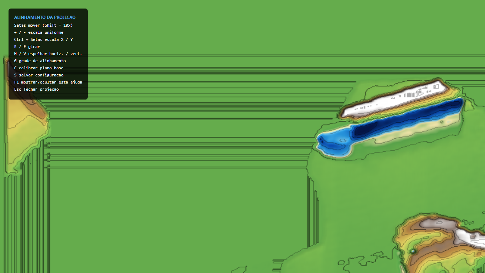

**Legenda:** A saída que vai para o projetor, ocupando o monitor inteiro, com o painel de
atalhos de alinhamento visível (tecla `F1` alterna). Capturada em monitor único de
1366×768, já que o projetor não estava conectado.

---

## 10 — Grade de alinhamento

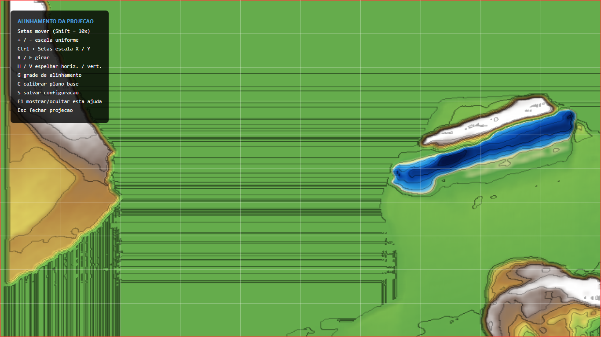

**Legenda:** Tecla `G` liga a grade de alinhamento: divisões finas a cada 10% e borda
vermelha grossa marcando o limite exato da área projetada. Serve para casar a projeção com
a borda física da caixa antes de colocar areia.

O branco chapado visível aqui é o bug do plano-base por média global — pixels que nunca
leram durante a calibração recebiam a média geral como referência e, ao lerem qualquer
coisa depois, saturavam no topo da escala. Corrigido posteriormente; a imagem fica como
registro do defeito.

**Onde usar:** manual de montagem, no passo de alinhamento do projetor.

---

## Imagens que ainda faltam

Estas dependem da caixa física montada e devem ser adicionadas na Fase 2 do roadmap:

- [ ] Caixa montada, vista geral, com pórtico, sensor e projetor
- [ ] Detalhe da fixação do Kinect e do projetor no pórtico
- [ ] Areia nivelada, antes da calibração
- [ ] Relevo esculpido por mãos, com projeção acompanhando
- [ ] Comparação antes/depois de uma intervenção no terreno
- [ ] Sombra causada pelas mãos durante a manipulação — para documentar a limitação
- [ ] Sala com iluminação de aula, mostrando a legibilidade real da projeção
- [ ] Cobertura de calibração acima de 90% numa caixa real

---

## 11 — Chuva em andamento

**Legenda:** Simulação de enchente rodando sobre relevo sintético. A água (azul) acumula
nas depressões enquanto as elevações permanecem secas. O painel mostra a contagem
regressiva da chuva e a área alagada em tempo real.

---

## 12 — Depois da chuva

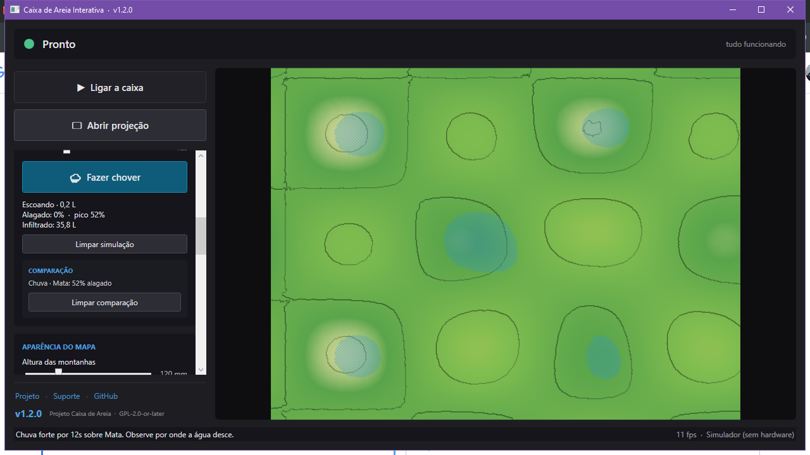

**Legenda:** O mesmo território depois que a chuva parou. A água escoou e infiltrou; o
painel guarda o **pico do episódio**, que é o número comparável entre um cenário e outro
— o valor instantâneo já não serve, porque o escoamento o diluiu.

---

## 13 — Tipos de cobertura do solo

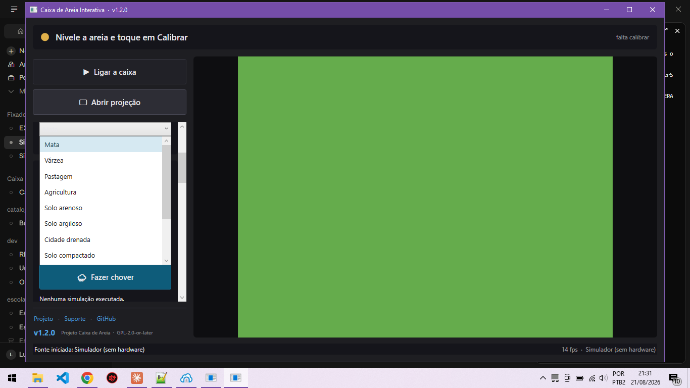

**Legenda:** As doze coberturas disponíveis, ordenadas da que mais protege à que menos
protege. Cada uma tem infiltração, capacidade de armazenamento, rugosidade e resistência
à erosão próprias — e a mesma chuva produz resultados muito diferentes entre elas.

---

## 14 — Saída do solver de água

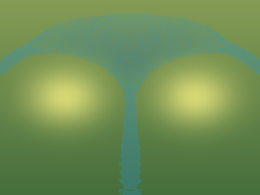

**Legenda:** Saída direta do modelo de tubos virtuais, sem a rampa hipsométrica. A água
contorna os dois morros (secos, em amarelo) e forma um canal de drenagem no vale entre
eles — o comportamento que a aula precisa que seja verdade.
